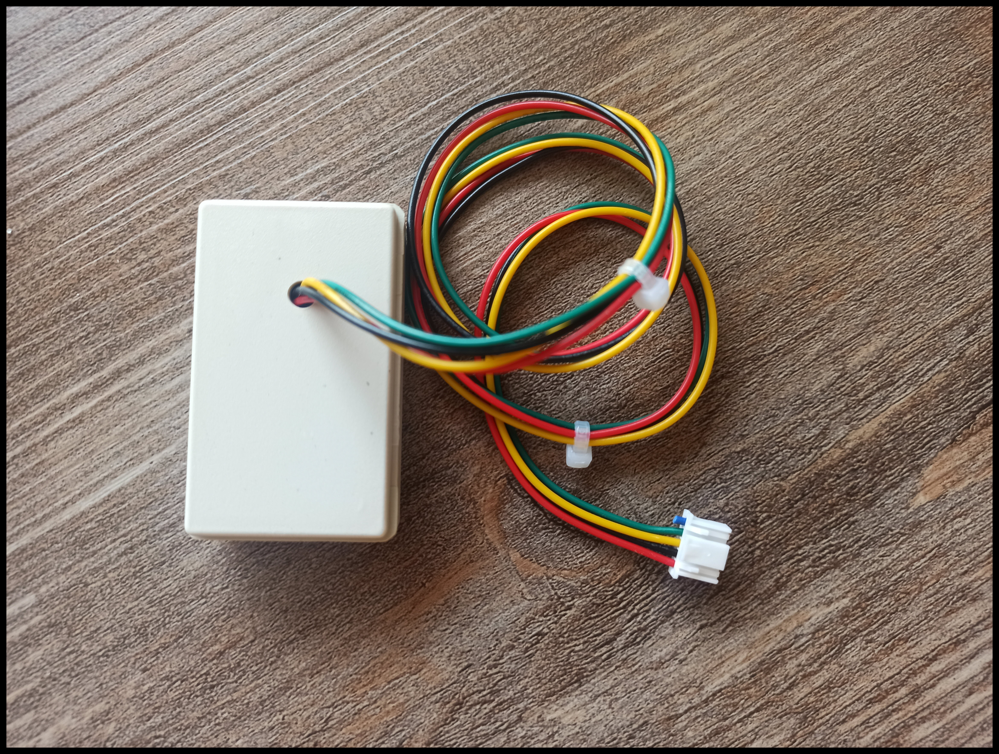

# CN105-2HA for Mitsubishi air conditioners
Controller for **Mitsubishi air conditioner** for **Home Assistant**

  

A cable with a **CN105** connector combined with an electronic circuit allows you to control most **Mitsubishi air conditioners** via home automation (Home Assistant, Jeedom…). This cable is relatively difficult to find and often at a high price.

It is based on **Echavet** software, and **ESP32 C3 Super Mini** controller.

🔵 Actual versions : Hardware : 2.0 ---- Software : 1.1

🟡 Last versions of the code : [Here](Code)

🟢 If you want to modify the script (Config_ESP32.yaml) yourself, [Click here](Documentation/Modifications_by_yourself.pdf) to read **Documentation/Modifications_by_yourself.pdf**.

 

> [!NOTE]
> **05/22/2026** : Several users have told me that at the startup, the **CN105-2HA** module sometimes does not connect properly to the **Mitsubishi** device. The workaround is to trigger the **CN105-2HA** module reset procedure using the entity : **button.clim_x_restart**.
>
>  
<strong>🚨 Over 1 300 controllers sold worldwide!</strong>

 
 

Compatible Air Conditioners

> ✅ The following air conditioners are known to work with the **CN105-2HA** module.
>
> 🔍 This list is **not exhaustive** and is based on user feedback and successful installations.

If your Mitsubishi Electric air conditioner has a **CN105 connector** on the indoor unit control board, there is a very high probability that the **CN105-2HA** module will be compatible.

To date, I have not encountered any model equipped with a CN105 connector that was not compatible.

---

## ✅ Confirmed Compatible Models

### MFZ Series

* MFZ-KA09NA

### MLZ Series

* MLZ-KP12NA

### MSXY Series

* MSXY-FN10VE
* MSXY-FN13VE
* MSXY-FN24VE

### MSZ-AP Series

* MSZ-AP20VGK
* MSZ-AP25VGK
* MSZ-AP35VGK
* MSZ-AP42VGK
* MSZ-AP50VGK
* MSZ-AP35VGD2

### MSZ-AY Series

* MSZ-AY20
* MSZ-AY25
* MSZ-AY35
* MSZ-AY42
* MSZ-AY50

### MSZ-EF Series

* MSZ-EF09NA
* MSZ-EF15NA
* MSZ-EF35VEB
* MSZ-EF42VE
* MSZ-EF50VE

### MSZ-FH Series

* MSZ-FHxxNA

### MSZ-FS Series

* MSZ-FSxxNA

### MSZ-FT Series

* MSZ-FT50VG2

### MSZ-GE Series

* MSZ-GE24NA

### MSZ-GL Series

* MSZ-GL06NA
* MSZ-GL09NA
* MSZ-GL12NA
* MSZ-GL15NA
* MSZ-GL18NA
* MSZ-GL24NA

### MSZ-GS Series

* MSZ-GS12NA

### MSZ-HR Series

* MSZ-HR25VF
* MSZ-HR35VF
* MSZ-HR45VF
* MSZ-HR50VF

### MSZ-LN Series

* MSZ-LN35VGW

### MSZ-SF Series

* MSZ-SF35VE3
* MSZ-SF50VE3

### PEFY Series

* PEFY-P32VMA-E2

### SEZ Series

* SEZ-KD25VAQ
* SEZ-M50DAL

---

## ⚠️ Special Cases

### PEH-6EAK

**Please contact me before ordering.**

This is an older model that requires a slightly different configuration.

### MSZ-A24NA

**Please contact me before ordering for compatibility confirmation.**

---

## 🔍 Your Model Is Not Listed?

The compatibility list above is not exhaustive.

If your indoor unit has a **CN105 connector**, there is a very high chance that the **CN105-2HA** module will work with your system.

Please send me:

* A photo showing the CN105 connector
* The indoor unit model number

and I will be happy to verify compatibility for you.

---

## 📷 Example of a CN105 Connector

If you are unsure whether your air conditioner is compatible, remove the front cover of the indoor unit and locate the control board.

Look for a connector labeled **CN105**.

If present, please send me a photo and I will confirm compatibility.
